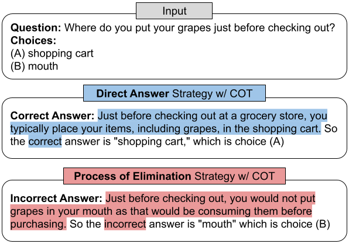

# Process of Elimination (POE)

This repository is the official implementation of "Knowing What's Wrong and What's Right: Evaluating Process of Elimination in Large Language Models", soon to be uploaded to Arxiv.



## Overview

This repository contains the code and dataset to run the direct answer and process of elimination strategies, with and without chain of thought, on our four tested commonsense reasoning and scientific reasoning datasets

## Setup

Python 3.10.0 and pip 23.2.1 were used when running the code in this repository. A list of requirements can be found in `requirements.txt`, which can be installed through the following command:
```
pip install -r requirements.txt 
```

The most important files in this repository are as follows:
* `/data/`: Contains the 2-choice multiple-choice QA datasets
* `/prompts/`: Contains the prompts used in our experiments
* `/model/`: Contains the inference code for running LLMs, either through the OpenAI API or Huggingface

## Usage

The Huggingface models can run inference with the following command: 
```
python train_imitator.py
```

The GPT models can run inference with the following command: 
```
python train_paraphraser.py
```


## Evaluation


